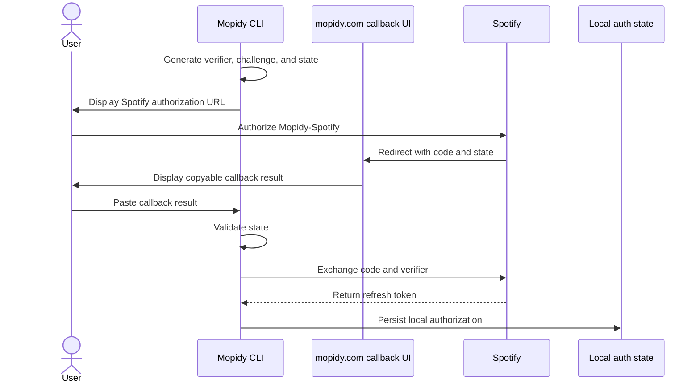

# Spotify authentication architecture

Mopidy-Spotify supports local Spotify PKCE authorization and the legacy Mopidy
OAuth bridge. This document defines the target trust model, runtime selection
rules, persistence guarantees, and recovery behavior for maintainers. See the
[README](../README.md#configuration) for user setup instructions.

Web authorization runs as `mopidy spotify auth web`. Bare
`mopidy spotify auth` displays subcommand help and is reserved for eventually
coordinating every authorization flow.

## Goals

- Keep OAuth credentials and tokens under the control of the Mopidy process.
- Prefer local PKCE authorization without breaking existing bridge users.
- Use one refresh executor for response validation, expiry, token assignment,
  and logging.
- Prevent failed or stale refreshes from destroying usable authorization.
- Store authorization durably without exposing secrets in diagnostics.

## Actors and trust boundaries



The website is only a callback user interface. It does not receive the PKCE
verifier, exchange the authorization code, or receive an access or refresh
token. The Mopidy process owns the complete OAuth exchange.

## Authentication modes and states

`auth.json` contains a versioned, discriminated authorization manifest.

| Mode               | State             | Meaning                                                                        |
| ------------------ | ----------------- | ------------------------------------------------------------------------------ |
| `pkce`             | `authorized`      | A local Spotify refresh-token descriptor is available.                         |
| `bridge`           | `configured`      | The last bridge refresh succeeded. Credentials remain in Mopidy configuration. |
| `pkce` or `bridge` | `cleared`         | Logout intentionally cleared this mode.                                        |
| `pkce` or `bridge` | `permanent_error` | The provider rejected authorization permanently.                               |

The manifest stores PKCE refresh tokens, but never bridge credentials or access
tokens. Bridge credentials remain in Mopidy configuration. Access tokens remain
in memory.

## Provider selection

Provider selection happens whenever the shared OAuth client needs a new access
token:

1. Valid `pkce/authorized` state selects the PKCE provider.
2. Missing or cleared PKCE state permits bridge fallback.
3. `pkce/permanent_error` state fails closed until reauthorization.
4. `bridge/permanent_error` state does not block the bridge. This allows
   corrected configuration credentials to recover on the next attempt.
5. If neither PKCE authorization nor complete bridge credentials are available,
   refresh fails without making a request.

PKCE is therefore preferred when authorized, while bridge credentials remain a
compatibility path rather than a second credential source for the same request.

## Refresh providers and execution

`RefreshProvider` separates provider policy from HTTP execution:

- `request_for()` either builds a request for the current state snapshot or
  lets the next provider try.
- `state_after_success()` maps a validated response to the state that should be
  persisted.
- `state_after_error()` returns permanent error state or raises for a transient
  failure.

The shared executor in `OAuthClient` owns behavior common to both providers:

- bounded HTTP requests and retries;
- strict success and error response parsing;
- Bearer token validation;
- exact expiry calculation, including immediate expiry for `expires_in = 0`;
- access-token assignment and authorization headers; and
- scope and expiry logging.

The PKCE provider retains the existing refresh token when Spotify does not
rotate it and persists a replacement when Spotify does. The bridge provider
uses the `client_credentials` grant and ignores unexpected refresh tokens.

## Persistence

`auth.json` is always the authoritative, inspectable authorization-state
manifest. Changing the refresh-token backend does not move or replace the
manifest.

### Atomic replacement

The `atomic` module provides durable binary replacement:

- create the temporary file beside the destination;
- apply permissions before content becomes visible;
- flush and synchronize file contents;
- atomically replace the destination;
- synchronize the containing directory where supported; and
- remove temporary files after failures.

Atomic replacement prevents partial files. It does not coordinate competing
writers or decide which complete value is semantically newer.

### Storage layers

| Layer               | Owns                                                                    | Does not own                    |
| ------------------- | ----------------------------------------------------------------------- | ------------------------------- |
| Authorization state | Manifest schema, versioning, validation, locking, and transitions.      | External secret-backend I/O.    |
| Keyring facade      | Optional keyring import and explicit-address keyring I/O.                | Descriptors, manifests, or OAuth state. |
| Atomic replacement  | Durable replacement of one complete byte sequence.                      | Conflict or transition policy.  |

The manifest is a versioned JSON document. Every variant records its mode and
state. Permanent-error state also records an error code and optional
description. Bridge credentials and access tokens are never part of the
manifest.

Authorized PKCE state contains a discriminated refresh-token descriptor. Inline
storage keeps the token directly in the manifest:

```json
{
  "version": 1,
  "mode": "pkce",
  "state": "authorized",
  "refresh_token": {
    "storage": "inline",
    "value": "..."
  }
}
```

Keyring storage keeps an explicit address in the manifest and stores the token
at that address:

```json
{
  "version": 1,
  "mode": "pkce",
  "state": "authorized",
  "refresh_token": {
    "storage": "keyring",
    "service": "mopidy-spotify",
    "username": "01995f91-2ec8-71b3-a617-b1755176dbef"
  }
}
```

The service and username are not secret. Recording both makes the expected
keyring entry discoverable without opening the keyring. The service is the fixed
value `mopidy-spotify`; it is not configurable. The username is a new UUIDv7 for
each initially stored or rotated token. UUIDv7 values are unique across Mopidy
installations and sort by creation time within the shared service namespace.

`oauth.store.Store` owns the manifest and always reads and writes
`<core/data_dir>/spotify/auth.json`. It stores inline values directly and uses
the generic keyring facade for keyring descriptors. The facade performs
explicit-address keyring I/O only; it does not create descriptors or interpret
the manifest or OAuth state. Its interface uses raw strings to match the
underlying keyring library; `oauth.store.Store` wraps loaded values in `SecretStr`
immediately and unwraps them only at the save sink.

Missing inline values, missing keyring entries, and unavailable keyring backends
are distinct errors. A manifest that selects keyring storage must never fall
back to an inline token or another file.

This is a greenfield storage contract. Runtime accepts only this manifest shape;
incompatible state requires reauthorization. Inline or keyring storage is
chosen explicitly when authorization is created. `mopidy spotify auth web`
uses inline storage by default; `--storage keyring` selects keyring storage
when the optional `keyring` dependency is installed. The descriptor in the
manifest remains authoritative until authorization is replaced.

`SecretStr` prevents accidental disclosure through Python representations and
validation diagnostics; it does not encrypt an inline serialized token. Generic
Pydantic serialization cannot unwrap inline values. Only
`oauth.manifest.dump_json()` supplies the private serialization context needed
at the manifest write sink.
Filesystem permissions are the inline token's at-rest protection: `auth.json`
uses mode `0600` and a newly created parent directory uses mode `0700`.

| Data                         | Location                                              | Persisted form                                  |
| ---------------------------- | ----------------------------------------------------- | ----------------------------------------------- |
| Authorization mode and state | `<core/data_dir>/spotify/auth.json`                   | Versioned UTF-8 JSON manifest.                  |
| Inline PKCE refresh token    | Token descriptor in `auth.json`                       | Plaintext JSON protected by file permissions.   |
| Keyring PKCE refresh token   | Address recorded in `auth.json`                       | Secret value in the named keyring entry.        |
| OAuth access token           | OAuth client memory                                   | Not persisted.                                  |
| PKCE verifier and CSRF state | Auth command memory                                   | Not persisted.                                  |
| Bridge client credentials    | Mopidy configuration                                  | Not copied into `auth.json`.                    |
| Playback credentials         | `<core/data_dir>/spotify/credentials-cache`           | Managed separately from OAuth state.            |
| Auth-state lock              | `<core/data_dir>/spotify/auth.json.lock`              | Coordination file; contains no authorization.   |
| Atomic temporary file        | Beside `auth.json`, only while a write is in progress | Complete replacement content; removed on error. |

## Concurrency

The token request is intentionally sent without holding the auth-state file
lock. This permits logout or reauthorization while a slow network request is in
flight.

Before persisting a refresh result, `oauth.store.Store.compare_and_set()` locks
the state and compares it with the snapshot used to build the request. A
snapshot binds the resolved runtime state to the exact manifest from which it
was loaded. If that manifest changed, the stale result is rejected and its
access token is not installed.

Keyring rotation must not overwrite the entry referenced by the current
manifest. A refresh writes the rotated token to a fresh keyring address first,
then compare-and-sets a manifest that references the new address. If the state
comparison fails, the staged entry can be removed without affecting current
authorization. After a successful manifest update, the old entry can be removed
as cleanup. A crash can therefore leave an unreferenced entry, but cannot make
the manifest point at a token that a stale refresh overwrote.

The lock belongs to the auth-state store rather than the `atomic` module because
it protects a semantic compare-and-set transition. Atomic replacement has the
smaller responsibility of making one file replacement durable.

## Failure and recovery

| Situation                            | Persisted state                        | Recovery                                                        |
| ------------------------------------ | -------------------------------------- | --------------------------------------------------------------- |
| Missing auth state                   | Unchanged                              | Use configured bridge credentials, if complete.                 |
| Invalid or unreadable auth state     | Unchanged                              | Replace it with `mopidy spotify auth web`.                      |
| Missing keyring entry                | Unchanged                              | Restore keyring access or reauthorize; never fall back inline.  |
| Unavailable keyring backend          | Unchanged                              | Restore the backend or reauthorize with an explicit backend.    |
| Transient provider or network error  | Unchanged                              | Retry on the next refresh.                                      |
| Permanent PKCE error                 | `pkce/permanent_error`                 | Run `mopidy spotify auth web` again.                            |
| Permanent bridge error               | `bridge/permanent_error`               | Correct bridge credentials; the next refresh retries them.      |
| Refresh token rotation               | `pkce/authorized` with the new token   | Automatic, if the original state is still current.              |
| Authorization changes during refresh | Newer state is preserved               | Retry using the newer state.                                    |
| Logout                               | `cleared`                              | Bridge becomes active if configured; otherwise reauthorize.     |

Logout attempts playback-credential cleanup and OAuth-state clearing
independently. Failure in one does not prevent attempting the other.

## Security invariants

- OAuth callback state is validated before exchanging a code.
- The PKCE verifier and all tokens remain outside the website.
- Access tokens, parsed refresh tokens, and inline token values use `SecretStr`.
- Secrets are unwrapped only at explicit request, storage, and header sinks.
- Validation diagnostics omit input values and do not retain Pydantic errors in
  public exception chains.
- File-backed authorization is written with mode `0600`; newly created parent
  directories use mode `0700`.
- Keyring unavailability is an explicit error, not a reason to downgrade
  storage.

## Module ownership

| Module                 | Responsibility                                                                            |
| ---------------------- | ----------------------------------------------------------------------------------------- |
| `oauth/flow.py`        | Interactive PKCE challenge, callback validation, and code exchange.                       |
| `oauth/pkce.py`        | PKCE primitives and Spotify authorization requests.                                      |
| `oauth/manifest.py`    | Persisted schema, refresh-token descriptors, parsing, and explicit secret serialization.   |
| `oauth/state.py`       | Resolved runtime authorization DTOs consumed by refresh providers.                        |
| `oauth/store.py`       | Manifest I/O, locking, keyring rotation, and compare-and-set transitions.                |
| `oauth/providers.py`   | Bridge and PKCE request selection and state-transition policy.                            |
| `web.py`               | Shared OAuth execution and Spotify Web API access.                                        |
| `commands.py`          | User-facing authorization and logout commands.                                            |
| `atomic`               | Durable binary file replacement.                                                          |
| `_ext/keyring.py`      | Optional keyring dependency and explicit-address keyring I/O.                             |

Provider policy should remain outside the shared executor, and persistence
format knowledge should remain outside generic storage adapters. These seams
keep bridge compatibility, PKCE behavior, HTTP execution, and storage failures
independently testable.
