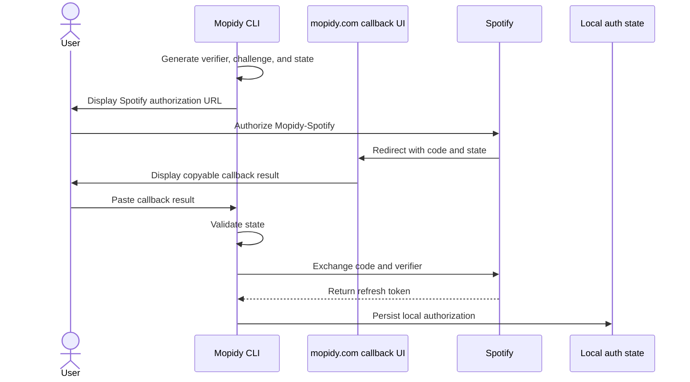
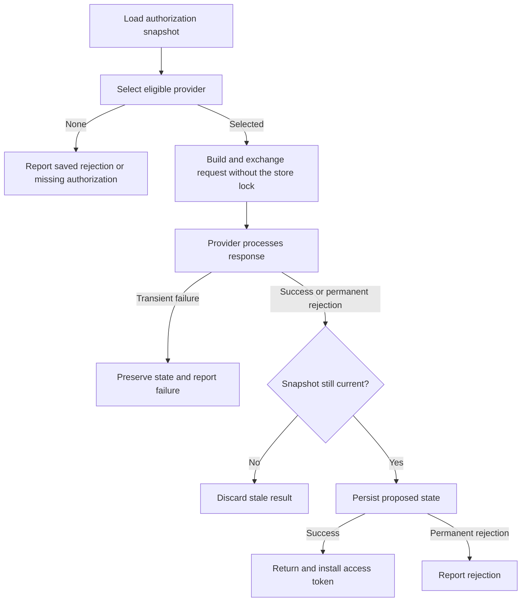

# Spotify authentication architecture

Mopidy-Spotify supports local Spotify PKCE authorization and the legacy Mopidy
OAuth bridge. This document describes the trust model, runtime selection
rules, persistence guarantees, and recovery behavior for maintainers. See the
[README](../README.md#configuration) for user setup instructions.

## Goals

- Keep OAuth credentials and tokens under the control of the Mopidy process.
- Prefer local PKCE authorization without breaking existing bridge users.
- Use one refresh executor for response validation, expiry, token assignment,
  and logging.
- Prevent failed or stale refreshes from destroying usable authorization.
- Store authorization durably without exposing secrets in diagnostics.
- Keep public Web API authorization separate from librespot playback
  credentials.

## Separate authorization systems

Spotify's public Web API and librespot playback require different credentials:

- `mopidy spotify auth web` runs the local PKCE flow documented below and
  stores Web API authorization in `auth.json`.
- `mopidy spotify auth playback` runs `gstspotify-auth`, which uses Spotify's
  desktop-client authorization and stores reusable librespot credentials in
  `credentials-cache/credentials.json`.
- `mopidy spotify auth status` reports both credential sets independently.
- Bare `mopidy spotify auth` displays command help. It is reserved for
  eventually running both authorization flows.

The credentials are not interchangeable. Public Web API tokens fail librespot
playback with `INVALID_CREDENTIALS`. Desktop-client playback credentials do not
work with Spotify's public Web API. Runtime therefore never passes the Web API
access token to `spotifyaudiosrc`; playback uses only its credentials cache.

## Actors and trust boundaries


```mermaid
sequenceDiagram
    actor User
    participant CLI as Mopidy CLI
    participant Site as mopidy.com callback UI
    participant Spotify as Spotify
    participant State as Local auth state

    CLI->>CLI: Generate verifier, challenge, and state
    CLI->>User: Display Spotify authorization URL
    User->>Spotify: Authorize Mopidy-Spotify
    Spotify->>Site: Redirect with code and state
    Site->>User: Display copyable callback result
    User->>CLI: Paste callback result
    CLI->>CLI: Validate state
    CLI->>Spotify: Exchange code and verifier
    Spotify-->>CLI: Return refresh token
    CLI->>State: Persist local authorization
```

The website is only a callback user interface. It does not receive the PKCE
verifier, exchange the authorization code, or receive an access or refresh
token. The Mopidy process owns the complete OAuth exchange.

## Authentication modes and states

`auth.json` contains a versioned, discriminated authorization manifest.

| Mode               | State             | Meaning                                                                        |
| ------------------ | ----------------- | ------------------------------------------------------------------------------ |
| `pkce`             | `authorized`      | A local Spotify refresh-token descriptor is available.                         |
| `bridge`           | `configured`      | The last bridge refresh succeeded. Credentials remain in Mopidy configuration. |
| `pkce` or `bridge` | `cleared`         | Logout intentionally cleared this mode.                                        |
| `pkce`             | `permanent_error` | The rejected grant requires reauthorization.                                   |
| `bridge`           | `permanent_error` | The rejected credential pair is blocked until credentials change or state is cleared. |

The manifest stores PKCE refresh tokens, but never bridge credentials or access
tokens. Bridge credentials remain in Mopidy configuration. Access tokens remain
in memory.

## Provider selection

The Spotify access-token source selects a provider whenever the shared OAuth
client needs a new access token:

1. Valid `pkce/authorized` state selects the PKCE provider.
2. Missing or cleared authorization permits bridge fallback. Configured bridge
   state also selects the bridge.
3. `pkce/permanent_error` state fails closed until reauthorization.
4. `bridge/permanent_error` state blocks the rejected credential pair using its
   saved fingerprint. Changing either configured credential permits another attempt.
   Legacy errors without a fingerprint permit retry; a new rejection records one.
   Configuration changes take effect when the backend is restarted.
5. If neither PKCE authorization nor complete bridge credentials are available,
   refresh fails without making a request.

Invalid manifests, unresolved secrets, and unavailable storage fail before
selection. They never trigger bridge fallback.

PKCE is therefore preferred when authorized, while bridge credentials remain a
compatibility path rather than a second credential source for the same request.

## Refresh providers and execution

`SpotifyAccessTokenSource` receives an authorization store, a `PkceProvider`,
and a `BridgeProvider`. The backend supplies these explicitly. The coordinator
owns selection: providers do not try another grant after a rejected exchange.

`RefreshProvider` owns grant-specific eligibility, request construction, and
response processing. Each provider supplies:

- `supports(auth_state)`: whether the authorization and configured credentials
  permit this grant;
- `request(auth_state)`: the grant-specific token request;
- `process(auth_state, response, status_code)`: the proposed next authorization state,
  or an exception for a transient failure that must leave state unchanged.

The HTTP status remains an integer because endpoints can return codes outside
Python's `HTTPStatus` enum. Policies compare recognized codes against enum
constants without rejecting unrecognized codes at the transport seam.

The coordinator's transaction is:


```mermaid
flowchart TD
    A[Load authorization snapshot] --> B[Select eligible provider]
    B -->|None| C[Report saved rejection or missing authorization]
    B -->|Selected| D[Build and exchange request without the store lock]
    D --> E[Provider processes response]
    E -->|Transient failure| F[Preserve state and report failure]
    E -->|Success or permanent rejection| G{Snapshot still current?}
    G -->|No| H[Discard stale result]
    G -->|Yes| I[Persist proposed state]
    I -->|Success| J[Return and install access token]
    I -->|Permanent rejection| K[Report rejection]
```

Selection is the only point at which bridge fallback is allowed. A transient
failure, permanent rejection, or failed conditional persistence does not start
an exchange with another provider.

The generic `OAuthClient` exchanges requests through shared HTTP logic and owns:

- bounded HTTP requests and retries;
- strict success and error response parsing;
- Bearer token validation;
- exact expiry calculation, including immediate expiry for `expires_in = 0`;
- access-token assignment and authorization headers; and
- scope and expiry logging.

The PKCE provider proposes a replacement when Spotify supplies a non-empty
refresh token; otherwise it retains the existing token. The coordinator and
store persist that proposal. The bridge provider
uses the `client_credentials` grant and ignores unexpected refresh tokens.

`SpotifyAccessTokenSource.refresh(exchange)` persists the proposed transition
before returning a successful access token. The OAuth client installs the token
only after that return. The Web client contains Spotify Web behavior, not grant
selection or persisted authorization-state policy.

PKCE rejection requires reauthorization. Bridge rejection instead records which
configured credentials failed: matching credentials remain blocked across
restarts, while changed credentials can recover. Success or reset removes the
fingerprint; transient failure preserves it. See [bridge rejection](bridge-rejection.md)
for Spotify's expiry policy, the legacy workaround, and downgrade behavior.
The fingerprint handles token-endpoint rejection, not Web API 401/403 responses.

## Persistence

`auth.json` is always the authoritative, inspectable authorization-state
manifest. Changing the refresh-token backend does not move or replace the
manifest.

### Atomic replacement

The `atomic` module provides durable binary replacement:

- create the temporary file beside the destination;
- apply permissions before content becomes visible;
- flush and synchronize file contents;
- atomically replace the destination;
- synchronize the containing directory where supported; and
- remove temporary files after failures.

Atomic replacement prevents partial files. It does not coordinate competing
writers or decide which complete value is semantically newer.

### Storage layers

| Layer               | Owns                                                                    | Does not own                    |
| ------------------- | ----------------------------------------------------------------------- | ------------------------------- |
| Authorization state | Manifest schema, versioning, validation, locking, and transitions.      | External secret-backend I/O.    |
| Keyring facade      | Optional keyring import and explicit-address keyring I/O.                | Descriptors, manifests, or OAuth state. |
| Atomic replacement  | Durable replacement of one complete byte sequence.                      | Conflict or transition policy.  |

The manifest is a versioned JSON document. Every variant records its mode and
state. Permanent-error state records an error code and optional description.
Bridge errors can also contain `credential_fingerprint`, a salted scrypt hash
of the rejected credential pair. Legacy errors can omit it; PKCE errors cannot
contain it. Absent optional values are omitted when writing JSON and read back
as `None`. Bridge credentials and access tokens are never part of the manifest.

Authorized PKCE state contains a discriminated refresh-token descriptor. Inline
storage keeps the token directly in the manifest:

```json
{
  "version": 1,
  "mode": "pkce",
  "state": "authorized",
  "refresh_token": {
    "storage": "inline",
    "value": "..."
  }
}
```

Keyring storage keeps an explicit address in the manifest and stores the token
at that address:

```json
{
  "version": 1,
  "mode": "pkce",
  "state": "authorized",
  "refresh_token": {
    "storage": "keyring",
    "service": "mopidy-spotify",
    "username": "01995f91-2ec8-71b3-a617-b1755176dbef"
  }
}
```

The service and username are not secret. Recording both makes the expected
keyring entry discoverable without opening the keyring. The service is the fixed
value `mopidy-spotify`; it is not configurable. The username is a new UUIDv7 for
each initially stored or rotated token. UUIDv7 combines creation time with random
bits for collision-resistant names. The Python 3.13 fallback does not guarantee
ordering within a millisecond or across clock adjustments.

`oauth.store.Store` owns the manifest and always reads and writes
`<core/data_dir>/spotify/auth.json`, where `<core/data_dir>` is a placeholder for
Mopidy's configured `[core] data_dir` value. It stores inline values directly and uses
the generic keyring facade for keyring descriptors. The facade performs
explicit-address keyring I/O only; it does not create descriptors or interpret
the manifest or OAuth state. Its interface uses raw strings to match the
underlying keyring library; `oauth.store.Store` wraps loaded values in `SecretStr`
immediately and unwraps them only at the save sink.

Missing inline values, missing keyring entries, and unavailable keyring backends
are distinct errors. A manifest that selects keyring storage must never fall
back to an inline token or another file.

Runtime accepts only this versioned manifest shape;
incompatible state requires reauthorization. Inline or keyring storage is
chosen explicitly when authorization is created. `mopidy spotify auth web`
uses inline storage by default; `--storage keyring` selects keyring storage
when the optional `keyring` dependency is installed in Mopidy's Python
environment. The keyring backend must also be accessible and unlocked for the
Mopidy user; installing the package alone is not enough, especially for headless
services. The descriptor in the manifest remains authoritative until
authorization is replaced.

`SecretStr` prevents accidental disclosure through Python representations and
validation diagnostics; it does not encrypt an inline serialized token. Generic
Pydantic serialization cannot unwrap inline values. Only
`oauth.manifest.dump_json()` supplies the private serialization context needed
at the manifest write sink.
Filesystem permissions are the inline token's at-rest protection: `auth.json`
uses mode `0600` and a newly created parent directory uses mode `0700`.

| Data                         | Location                                              | Persisted form                                  |
| ---------------------------- | ----------------------------------------------------- | ----------------------------------------------- |
| Authorization mode and state | `<core/data_dir>/spotify/auth.json`                   | Versioned UTF-8 JSON manifest.                  |
| Inline PKCE refresh token    | Token descriptor in `auth.json`                       | Plaintext JSON protected by file permissions.   |
| Keyring PKCE refresh token   | Address recorded in `auth.json`                       | Secret value in the named keyring entry.        |
| OAuth access token           | OAuth client memory                                   | Not persisted.                                  |
| PKCE verifier and CSRF state | Auth command memory                                   | Not persisted.                                  |
| Bridge client credentials    | Mopidy configuration                                  | Not copied into `auth.json`.                    |
| Rejected bridge credential fingerprint | Bridge permanent-error state in `auth.json`                  | Salted scrypt hash; removed on success or reset. |
| Playback credentials         | `<core/data_dir>/spotify/credentials-cache`           | Managed separately from OAuth state.            |
| Auth-state lock              | `<core/data_dir>/spotify/auth.json.lock`              | Coordination file; contains no authorization.   |
| Atomic temporary file        | Beside `auth.json`; may remain after abrupt termination | Replacement content; removed on normal completion or exception. |

## Concurrency

The token request is intentionally sent without holding the auth-state file
lock. This permits logout or reauthorization while a slow network request is in
flight.

Before persisting a refresh result, `oauth.store.Store.compare_and_set()` locks
the state and compares it with the snapshot used to build the request. A
snapshot binds the resolved runtime state to the exact manifest from which it
was loaded. If that manifest changed, the stale result is rejected and its
access token is not installed.

Keyring rotation must not overwrite the entry referenced by the current
manifest. Under the store lock, a refresh first checks the snapshot. If it is
stale, no token is staged. Otherwise, the store writes the rotated token to a
fresh address, replaces the manifest, then retires the old entry.

If writing the manifest fails, the staged token is removed only when the store
can confirm that the manifest does not reference it. A crash or failed cleanup
can leave an orphaned entry, but must not delete a token still referenced by the
manifest. The snapshot comparison includes bridge fingerprints too, so an old
exchange cannot overwrite a newer persisted rejection.

### Orphaned files and keyring entries

Normal completion or an exception removes the atomic temporary file. A crash,
SIGKILL, or power loss can bypass cleanup and leave `.auth.json.*` files beside
the manifest. These files use mode `0600` and may contain inline refresh tokens.

Keyring entries can also remain after interrupted token staging or failed
cleanup of replaced entries. When a failed manifest write leaves uncertainty,
the store keeps the staged entry rather than risk deleting a referenced token.

There is no automatic sweep for either kind of orphan. The keyring service is a
shared namespace within the user's keyring, not private to one Mopidy instance.
Its name is currently hardcoded to `mopidy-spotify`; multiple instances using
the same keyring use that service. UUIDv7 entry names make collisions unlikely,
so instances can coexist without overwriting each other's tokens. Those names
do not establish ownership, however. Each instance's `auth.json` identifies only
its active entry, so an unreferenced entry may belong to another instance rather
than be orphaned. There is no per-instance ownership marker for safe sweeping.
Future cleanup must establish that ownership and coordinate with active writers
through the store lock.

If sharing the service becomes a problem, its name could become configurable so
instances can use separate namespaces. Existing descriptors would still need to
retain their recorded service names so stored tokens remain discoverable.

The lock belongs to the auth-state store rather than the `atomic` module because
it protects a semantic compare-and-set transition. Atomic replacement has the
smaller responsibility of making one file replacement durable.

## Failure and recovery

| Situation                            | Persisted state                        | Recovery                                                        |
| ------------------------------------ | -------------------------------------- | --------------------------------------------------------------- |
| Missing auth state                   | Unchanged                              | Use configured bridge credentials, if complete.                 |
| Invalid or unreadable auth state     | Unchanged                              | Replace it with `mopidy spotify auth web`.                      |
| Missing keyring entry                | Unchanged                              | Restore keyring access or reauthorize; never fall back inline.  |
| Unavailable keyring backend          | Unchanged                              | Restore the backend or reauthorize with an explicit backend.    |
| Transient provider or network error  | Unchanged                              | Retry on the next refresh.                                      |
| Permanent PKCE error                 | `pkce/permanent_error`                 | Run `mopidy spotify auth web` again.                            |
| Permanent bridge error               | `bridge/permanent_error` with credential fingerprint | Change either bridge credential and restart; unchanged credentials remain blocked. |
| Legacy bridge error without fingerprint | `bridge/permanent_error` without credential fingerprint | Retry; a new permanent rejection records a fingerprint. |
| Refresh token rotation               | `pkce/authorized` with the new token   | Automatic, if the original state is still current.              |
| Authorization changes during refresh | Newer state is preserved               | Retry using the newer state.                                    |
| Logout                               | `cleared`                              | Bridge becomes active if configured; otherwise reauthorize.     |

`mopidy spotify logout` clears playback credentials and Web API authorization.
It attempts both independently, so failure in one does not prevent attempting
the other. Configured legacy bridge credentials remain in Mopidy configuration.

## Security invariants

- OAuth callback state is validated before exchanging a code.
- The PKCE verifier and all tokens remain outside the website.
- Access tokens, parsed refresh tokens, and inline token values use `SecretStr`.
- Secrets are unwrapped only at explicit request, storage, and header sinks.
- Validation diagnostics omit input values and do not retain Pydantic errors in
  public exception chains.
- File-backed authorization is written with mode `0600`; newly created parent
  directories use mode `0700`.
- Keyring unavailability is an explicit error, not a reason to downgrade
  storage.

## Module ownership

| Module                 | Responsibility                                                                            |
| ---------------------- | ----------------------------------------------------------------------------------------- |
| `oauth/flow.py`        | Interactive PKCE challenge, callback validation, and code exchange.                       |
| `oauth/pkce.py`        | PKCE primitives and Spotify authorization requests.                                      |
| `oauth/manifest.py`    | Persisted schema, refresh-token descriptors, parsing, and explicit secret serialization.   |
| `oauth/state.py`       | Resolved runtime authorization DTOs consumed by refresh providers.                        |
| `oauth/store.py`       | Manifest I/O, locking, keyring rotation, and compare-and-set transitions.                |
| `oauth/providers.py`   | Bridge and PKCE eligibility, requests, and response-to-state policy.                       |
| `oauth/credentials.py` | Fingerprints binding bridge rejection to the credential pair that failed.                 |
| `oauth/source.py`      | Spotify provider selection, resolved-state loading, and persistence before token use.     |
| `oauth/tokens.py`      | Shared exchange values, errors, and token-source interface.                               |
| `web.py`               | Shared OAuth execution and Spotify Web API access.                                        |
| `commands.py`          | User-facing authorization and logout commands.                                            |
| `_ext/atomic.py`        | Durable binary file replacement.                                                          |
| `_ext/keyring.py`      | Optional keyring dependency and explicit-address keyring I/O.                             |

Provider policy should remain outside the shared executor, and persistence
format knowledge should remain outside generic storage adapters. These seams
keep bridge compatibility, PKCE behavior, HTTP execution, and storage failures
independently testable.
