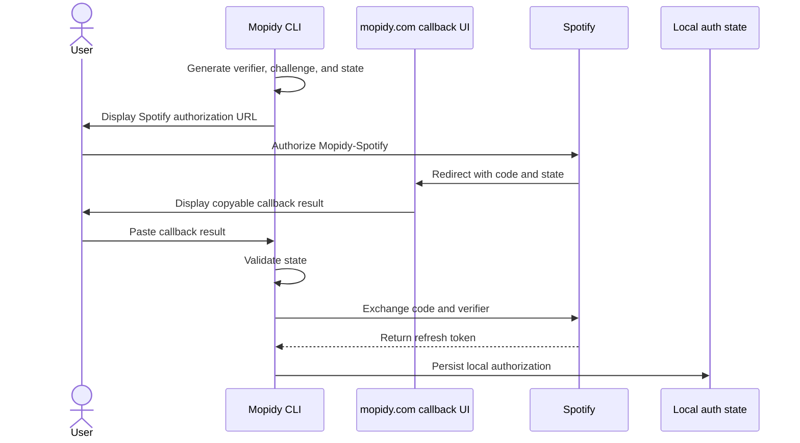
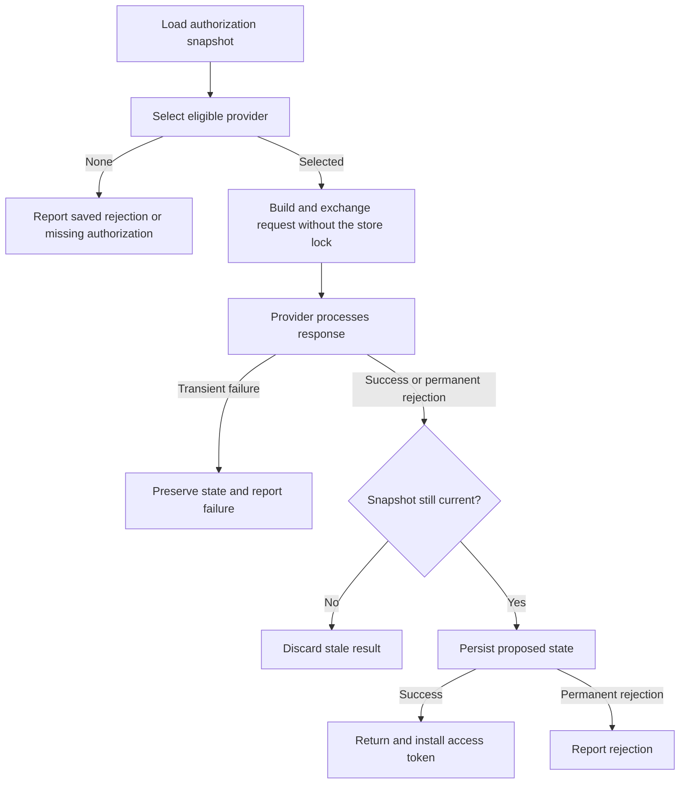

# Spotify authentication architecture

`mopidy spotify auth web` authorizes Spotify Web API access using OAuth's Proof
Key for Code Exchange (PKCE). Mopidy exchanges the authorization code directly
with Spotify and stores the refresh token locally. The legacy Mopidy OAuth
bridge remains supported for existing installations; it holds the Spotify grant
on a server run by a Mopidy maintainer.

This document explains the security and recovery decisions for maintainers.
See the [README](../README.md#configuration) for user setup instructions.

Playback credentials are separate from Web authorization; authorizing one does
not authorize the other.

## Actors and trust boundaries


```mermaid
sequenceDiagram
    actor User
    participant CLI as Mopidy CLI
    participant Site as mopidy.com callback UI
    participant Spotify as Spotify
    participant State as Local auth state

    CLI->>CLI: Generate verifier, challenge, and state
    CLI->>User: Display Spotify authorization URL
    User->>Spotify: Authorize Mopidy-Spotify
    Spotify->>Site: Redirect with code and state
    Site->>User: Display copyable callback result
    User->>CLI: Paste callback result
    CLI->>CLI: Validate state
    CLI->>Spotify: Exchange code and verifier
    Spotify-->>CLI: Return refresh token
    CLI->>State: Persist local authorization
```

The website is only a callback user interface. It does not receive the PKCE
verifier, exchange the authorization code, or receive an access or refresh
token. The Mopidy process owns the complete OAuth exchange.

## Authentication modes and states

`auth.json` records the authorization mode and its state. Keeping rejected and
cleared authorization distinct prevents an expired local grant from silently
reactivating old bridge credentials.

| Mode               | State             | Meaning                                                                        |
| ------------------ | ----------------- | ------------------------------------------------------------------------------ |
| `pkce`             | `authorized`      | A local Spotify refresh-token descriptor is available.                         |
| `bridge`           | `configured`      | Intent to use the bridge, whether or not its credentials are present or valid. |
| `pkce` or `bridge` | `cleared`         | Logout intentionally cleared this mode.                                        |
| `pkce`             | `permanent_error` | The rejected grant requires reauthorization.                                   |
| `bridge`           | `permanent_error` | The rejected credential pair is blocked until credentials change or state is cleared. |

The manifest stores PKCE refresh tokens, but never bridge credentials or access
tokens. Bridge credentials remain in Mopidy configuration. Access tokens remain
in memory.

## Provider selection

The Spotify access-token source selects a provider whenever the shared OAuth
client needs a new access token:

1. Valid `pkce/authorized` state selects the PKCE provider.
2. Missing or cleared authorization permits bridge fallback. Configured bridge
   state also selects the bridge.
3. `pkce/permanent_error` state fails closed until reauthorization.
4. `bridge/permanent_error` state blocks the rejected credential pair using its
   saved fingerprint. Changing either configured credential permits another attempt.
   Legacy errors without a fingerprint permit retry; a new rejection records one.
   Configuration changes take effect when the backend is restarted.
5. If neither PKCE authorization nor complete bridge credentials are available,
   refresh fails without making a request.

Invalid manifests, unresolved secrets, and unavailable storage fail before
selection. They never trigger bridge fallback.

PKCE is therefore preferred when authorized, while bridge credentials remain a
compatibility path rather than a second credential source for the same request.

Switching to PKCE is sticky: keeping or changing configured bridge credentials
does not override local authorization or a permanent PKCE error. To return to
the bridge, run `mopidy spotify auth web --legacy`. The command records explicit
`bridge/configured` intent, retires any superseded local refresh token, and leaves
cached playback credentials untouched. Missing credentials do not prevent
selection: the command warns that both `client_id` and `client_secret` must be
configured. Runtime reports missing credentials without an HTTP request or state
change; supplying them permits refresh after restarting Mopidy. Selecting the
bridge again preserves an existing bridge rejection and its credential fingerprint.
Selection is not validation: the command does not contact the bridge.

`oauth.store.Store.configure_bridge()` owns the locked transition and token
retirement. The CLI only requests this transition and reports configuration needs;
the PKCE browser flow remains separate. Unlike `clear()`, selection records intent
and does not reset bridge rejection. Successful bridge refresh retains configured
intent; permanent rejection records bridge error state. Both retain the chosen
provider without claiming credential validity.

`--storage` applies only to local authorization and cannot be combined with
`--legacy` except for the default `auto` choice. Bridge credentials remain in
Mopidy configuration. The bridge becomes eligible on the next refresh; restart
Mopidy to switch immediately.

If retiring a keyring token fails after bridge intent was saved, the command
reports failure but the bridge may already be selected. Restore keyring access
before cleaning up the orphaned entry; see
[orphaned files and keyring entries](#orphaned-files-and-keyring-entries).

Logout also clears Web authorization, but additionally removes playback
credentials. It does not disable configured bridge access; remove both bridge
credentials to remain logged out.

## Refresh and token rotation

`SpotifyAccessTokenSource` coordinates provider selection and persistence.
Providers handle grant-specific requests and state changes; `OAuthClient`
handles HTTP exchange, response validation, and access-token expiry. This keeps
bridge compatibility policy out of the shared HTTP client.

A refresh follows this sequence:


```mermaid
flowchart TD
    A[Load authorization snapshot] --> B[Select eligible provider]
    B -->|None| C[Report saved rejection or missing authorization]
    B -->|Selected| D[Build and exchange request without the store lock]
    D --> E[Provider processes response]
    E -->|Transient failure| F[Preserve state and report failure]
    E -->|Success or permanent rejection| G{Snapshot still current?}
    G -->|No| H[Discard stale result]
    G -->|Yes| I[Persist proposed state]
    I -->|Success| J[Return and install access token]
    I -->|Permanent rejection| K[Report rejection]
```

Selection is the only point at which bridge fallback is allowed. A transient
failure, permanent rejection, or failed conditional persistence does not start
an exchange with another provider.

The PKCE provider proposes a replacement when Spotify supplies a non-empty
refresh token; otherwise it retains the existing token. The coordinator and
store persist that proposal. The bridge provider uses the `client_credentials`
grant and ignores unexpected refresh tokens.

The new state is persisted before the access token is installed. Otherwise,
library access could appear to work while the rotated refresh token
was lost, leaving the next refresh unable to recover.

Bridge rejection records a fingerprint of the failed credentials so unchanged
credentials remain blocked across restarts without blocking corrected ones.
See [bridge rejection](bridge-rejection.md) for the rationale, Spotify's expiry
policy, and downgrade behavior.

## Persistence

`auth.json` is always the authoritative, inspectable authorization-state
manifest. Changing the refresh-token backend does not move or replace the
manifest.

The manifest lives at `<core/data_dir>/spotify/auth.json`, where `<core/data_dir>`
is Mopidy's configured `[core] data_dir`. Typical paths are
`~/.local/share/mopidy/spotify/auth.json` for a user installation and
`/var/lib/mopidy/spotify/auth.json` for a system service. This directory must be
writable by the Mopidy user.

Atomic replacement protects against partial files; compare-and-set under a
store lock protects against stale writers. These solve different problems:
a complete file can still contain an obsolete authorization state.

### Refresh-token storage

The command defaults to `--storage auto`: initial authorization tries to save
the actual refresh token in keyring and trusts the backend's write result.
There is no readback check or disposable probe entry. If the write fails, the
setup flow warns before explicitly saving the token as plaintext instead.

Initial storage policy is distinct from the backend recorded in the manifest.
`oauth.flow.StoragePolicy` describes the user's initial authorization choice:
strict plaintext, strict keyring, or keyring with plaintext fallback.
`AuthFlow` receives an `AuthorizationWriter` callable, not a storage policy or
file path. This keeps storage decisions and error translation outside the browser
flow, and keeps `auto` out of the persisted schema.

The initial-storage helper falls back only after `KeyringWriteError`, which means
the keyring manifest has not been published. Manifest-write, locking, and cleanup
errors are not reasons to switch storage. This keeps fallback policy out of the
generic keyring facade and the store's explicit persistence operations.

Only the chosen `inline` or `keyring` backend is recorded in the manifest, never
`auto`. The runtime does not re-detect storage or fall back from keyring to a file.
Automatic file selection warns on every
authorization attempt, including the first; runtime refreshes do not repeat this
setup warning.

`--storage plaintext` explicitly selects plaintext in `auth.json`, protected by
file permissions. Internally, the manifest calls this `inline` storage:

```json
{
  "version": 1,
  "mode": "pkce",
  "state": "authorized",
  "refresh_token": {
    "storage": "inline",
    "value": "..."
  }
}
```

Keyring storage keeps an explicit address in the manifest and stores the token
at that address:

```json
{
  "version": 1,
  "mode": "pkce",
  "state": "authorized",
  "refresh_token": {
    "storage": "keyring",
    "service": "mopidy-spotify",
    "username": "01995f91-2ec8-71b3-a617-b1755176dbef"
  }
}
```

The service and username are not secret. Recording both makes the expected
keyring entry discoverable without opening the keyring. Each new or rotated
token gets a fresh UUIDv7 address under the fixed `mopidy-spotify` service,
so saving one token does not overwrite another instance's token.

Missing inline values, missing keyring entries, and unavailable keyring backends
are distinct errors. A manifest that selects keyring storage must never fall
back to an inline token or another file.

To use keyring storage, install `keyring` in Mopidy's Python environment:

- For a system installation, use your distribution's package manager, for
  example `sudo apt install python3-keyring` on Debian.
- For a Python installation, install the optional `mopidy-spotify[keyring]` extra.

Then run `mopidy spotify auth web --storage keyring`, or
`sudo mopidyctl spotify auth web --storage keyring` for a system service.
The keyring must be accessible and unlocked for the Mopidy user, especially for
headless services. `--storage keyring` is strict: failure to save the returned
token fails authorization without selecting plaintext storage. `--storage plaintext`
is also strict: it stores the new token only in the protected file. When replacing
keyring authorization, it still attempts best-effort cleanup of the old keyring entry.

For services without a desktop session, follow
[keyring's headless Linux setup guide](https://pypi.org/project/keyring/#user-content-using-keyring-on-headless-linux-systems)
as the operating-system user that runs Mopidy.

The manifest records the chosen storage backend until authorization is replaced.
Incompatible manifest versions require reauthorization.

`SecretStr` and an explicit manifest serializer prevent accidental disclosure
through Python representations, validation diagnostics, or generic serialization.
They do not encrypt an inline token.
Filesystem permissions are the inline token's at-rest protection: `auth.json`
uses mode `0600` and a newly created parent directory uses mode `0700`.

## Concurrency

The token request is intentionally sent without holding the auth-state file
lock. This permits logout or reauthorization while a slow network request is in
flight.

Before persisting a refresh result, `oauth.store.Store.compare_and_set()` locks
the state and compares it with the snapshot used to build the request. A
snapshot binds the resolved runtime state to the exact manifest from which it
was loaded. If that manifest changed, the stale result is rejected and its
access token is not installed.

Keyring rotation must not overwrite the entry referenced by the current
manifest. Under the store lock, a refresh first checks the snapshot. If it is
stale, no token is staged. Otherwise, the store writes the rotated token to a
fresh address, replaces the manifest, then retires the old entry.

If writing the manifest fails, the staged token is removed only when the store
can confirm that the manifest does not reference it. A crash or failed cleanup
can leave an orphaned entry, but must not delete a token still referenced by the
manifest. The snapshot comparison includes bridge fingerprints too, so an old
exchange cannot overwrite a newer persisted rejection.

### Orphaned files and keyring entries

Normal completion or an exception removes the atomic temporary file. A crash,
SIGKILL, or power loss can bypass cleanup and leave `.auth.json.*` files beside
the manifest. These files use mode `0600` and may contain inline refresh tokens.

Keyring entries can also remain after interrupted token staging or failed
cleanup of replaced entries. When a failed manifest write leaves uncertainty,
the store keeps the staged entry rather than risk deleting a referenced token.

There is no automatic sweep for either kind of orphan. Multiple Mopidy instances
can share the `mopidy-spotify` keyring service. UUIDv7 entry names prevent
collisions but do not establish ownership: an entry absent from one instance's
manifest may belong to another. Safe cleanup would need to establish ownership
and coordinate with active writers through the store lock.

## Failure and recovery

| Situation                            | Persisted state                        | Recovery                                                        |
| ------------------------------------ | -------------------------------------- | --------------------------------------------------------------- |
| Missing auth state                   | Unchanged                              | Use configured bridge credentials, if complete.                 |
| Selected bridge without credentials  | `bridge/configured`                    | Configure both bridge credentials and restart Mopidy.           |
| Invalid or unreadable auth state     | Unchanged                              | Replace it with `mopidy spotify auth web`.                      |
| Missing keyring entry                | Unchanged                              | Restore keyring access or reauthorize; never fall back inline.  |
| Unavailable keyring backend          | Unchanged                              | Restore the backend or reauthorize with an explicit backend.    |
| Transient provider or network error  | Unchanged                              | Retry on the next refresh.                                      |
| Permanent PKCE error                 | `pkce/permanent_error`                 | Run `mopidy spotify auth web` again.                            |
| Permanent bridge error               | `bridge/permanent_error` with credential fingerprint | Change either bridge credential and restart; unchanged credentials remain blocked. |
| Legacy bridge error without fingerprint | `bridge/permanent_error` without credential fingerprint | Retry; a new permanent rejection records a fingerprint. |
| Refresh token rotation               | `pkce/authorized` with the new token   | Automatic, if the original state is still current.              |
| Authorization changes during refresh | Newer state is preserved               | Retry using the newer state.                                    |
| Logout                               | `cleared`                              | Bridge becomes active if configured; otherwise reauthorize.     |

Logout attempts playback-credential cleanup and OAuth-state clearing
independently. Failure in one does not prevent attempting the other.
